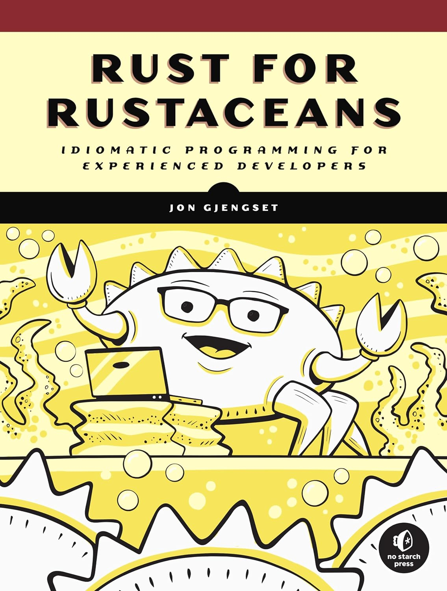
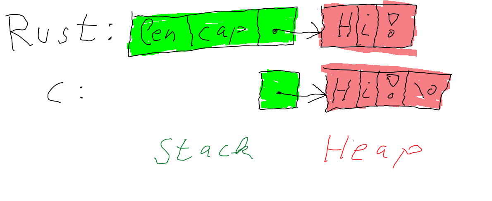
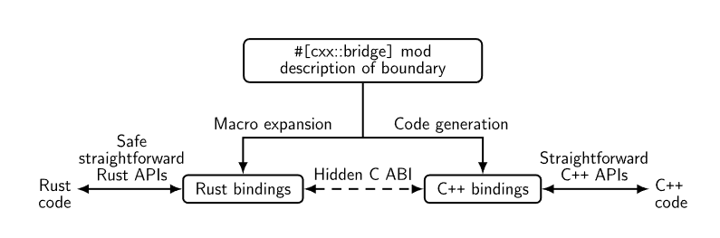

<style>
.container {
  display: flex;
}
.col{
  flex: 1;
  margin: 5px;
}
</style>

# Book Club - Rust for Rustaceans

## Chapter 11 - Foreign Function Interfaces


<div class="container">
<div class="col">

## Event Details

`Rust and C++ Dragons Meetup`

`Wendesday 02. Oct. 2024 7.30pm CET`

</div><div class="col">


</div><div class="col">


</div></div>


---

# Book Club - Rust for Rustaceans

## Chapter 11 - Foreign Function Interfaces


<div class="container">
<div class="col">

## Event Details

`Rust and C++ Dragons Meetup`

`Wendesday 02. Oct. 2024 7.30pm CET`

</div><div class="col">

## Persons

`Book Author: Jon Gjenset`

`Presenter: Tim Janus`

</div><div class="col">

## Get the Book

<div class="container">
<div class="col">



</div><div class="col">


</div></div>

[The Book](https://www.amazon.de/-/en/Jon-Gjengset-ebook/dp/B0957SWKBS)

and Visit [Jons YouTube Channel](https://www.youtube.com/@jonhoo)

</div></div>

---

# Foreign Function Interfaces (FFI)

## Chapter 11 - In a nutshell

- Crossing language boundaries
- Types across language boundaries
- Calling Rust from foreign languages, calling C from Rust 
- Small Example with focus on getting a C API safely in Rust
- Conclusion with good crates from the Rust Ecosystem

<style>
img[alt~="dragon"] {
  background-color: transparent!important;
  position: absolute;
  top: 290px;
  right: 150px;
}
</style>


---

# Foreign Function Interfaces (FFI)

## Chapter 11 - In a nutshell

- Crossing language boundaries
- Types across language boundaries
- Calling Rust from foreign languages, calling C from Rust
- Small Example with focus on getting a C API safely in Rust
- Conclusion with good crates from the Rust Ecosystem

## Awesome Chapter Introduction

`Not all Code is written in Rust. It's shocking, I know.` - Jon Gjenset

<style>
img[alt~="dragon"] {
  background-color: transparent!important;
  position: absolute;
  top: 290px;
  right: 150px;
}
</style>


---

# Foreign Function Interfaces (FFI)

## Chapter 11 - In a nutshell

- Crossing language boundaries
- Types across language boundaries
- Calling Rust from foreign languages, calling C from Rust 
- Small Example with focus on getting a C API safely in Rust
- Conclusion with good crates from the Rust Ecosystem

## After this talk you have a clue how to:

- Access functionality written in  other languages from Rust
- Access functionality written in  Rust from other languages
- Aaaand how that works under the hood

<style>
img[alt~="dragon"] {
  background-color: transparent!important;
  position: absolute;
  top: 290px;
  right: 150px;
}
</style>


---

# Agenda

- Motivation
- -> FFI Boundaries for Symbols and Functions
- Types across language boundaries
- Safety
  - A example of integrating a C Library
- Support from the Ecosystem for FFI
- Conclusion

---

# Definitions

## From the Book by Jon

FFI is, ultimately, all about accessing bytes that orignates somewhere outside your application's Rust code.

---

# Definitions

## From the Book by Jon

FFI is, ultimately, all about accessing bytes that orignates somewhere outside your application's Rust code.

<div class="container"><div class="col">

## Another Definition

Foreign Function Interfaces (FFI) enable code from different programming languages or even different compiler versions of the same language to interoperate by relying on the Application Binary Interface (ABI), which defines the low-level details of how these interactions occur at the binary level. 

</div><div class="col">

</div></div>


---

# Definitions

## From the Book by Jon

FFI is, ultimately, all about accessing bytes that orignates somewhere outside your application's Rust code.

<div class="container"><div class="col">

## Another Definition

Foreign Function Interfaces (FFI) enable code from different programming languages or even different compiler versions of the same language to interoperate by relying on the Application Binary Interface (ABI), which defines the low-level details of how these interactions occur at the binary level. 

</div><div class="col">

## What is the state of RUST ABI?

- [The path to a stable ABI for Rust](https://youtu.be/MY5kYqWeV1Q) - by Amanieu D'Antras
- However, we can and will change the ABI, to be C-compatible 

</div></div>

---

# Use-Cases for FFI

## Calling Rust Code in other languages

- Requirement for safe and fast libraries, possible solutions:
  - [Polars](https://pola.rs) over [Pandas](https://pandas.pydata.org/)
  - [OpEn](https://alphaville.github.io/optimization-engine/) (although that is Rust Code-Gen)
  - [ODE-solvers](https://github.com/srenevey/ode-solvers) over [ode-int](https://docs.scipy.org/doc/scipy/reference/generated/scipy.integrate.odeint.html)

---

# Use-Cases for FFI

## Calling Rust Code in other languages

- Requirement for safe and fast libraries, possible solutions:
  - [Polars](https://pola.rs) over [Pandas](https://pandas.pydata.org/)
  - [OpEn](https://alphaville.github.io/optimization-engine/) (although that is Rust Code-Gen)
  - [ODE-solvers](https://github.com/srenevey/ode-solvers) over [ode-int](https://docs.scipy.org/doc/scipy/reference/generated/scipy.integrate.odeint.html)

## Calling external Code From Rust

- Often a business decision as a trade-off between effort and time
  - A functionality is not yet available in Rust
  - A part of own-old legacy code that is not rewritten in Rust

---

# Use-Cases for FFI

## Calling Rust Code in other languages

- Requirement for safe and fast libraries, possible solutions:
  - [Polars](https://pola.rs) over [Pandas](https://pandas.pydata.org/)
  - [OpEn](https://alphaville.github.io/optimization-engine/) (although that is Rust Code-Gen)
  - [ODE-solvers](https://github.com/srenevey/ode-solvers) over [ode-int](https://docs.scipy.org/doc/scipy/reference/generated/scipy.integrate.odeint.html)

## Calling external Code From Rust

- Often a business decision as a trade-off between effort and time
  - A functionality is not yet available in Rust
  - A part of own-old legacy code that is not rewritten in Rust
  
<style>
img[alt~="desert"] {
  background-color: transparent!important;
  position: absolute;
  top: 220px;
  right: 150px;
  width: 600px
}
</style>


---

# Phases of Compilation

1. Compilation
  The source-code is transformed in a intermediate-code `Mid-level Intermediate Representation` short: [MIR](https://rustc-dev-guide.rust-lang.org/mir/index.html).
2. Code Generation
  Binary Machine code is generated from `MIR` and stored in so-called object files.
3. Linking
   All object files are linked together, ensuring that symbols that are only declared in some objects are found in other objects. (static linking)

---

# Symbols

- Used as a name to pass around the memory-address of a `function` or `variable`
- A symbol is ...
  - ... defined once
  - ... declared as many times as needed


---

# Symbols

- Used as a name to pass around the memory-address of a `function` or `variable`
- A symbol is ...
  - ... defined once
  - ... declared as many times as needed

Example providing and accessing static variables over FFI-boundaries:

```rust
#[no_mangle]
pub static RS_DEBUG: bool = true; // definition

extern {
  static FOREIGN_DEBUG: bool; // declaration
}
```

---

# Symbols

- Used as a name to pass around the memory-address of a `function` or `variable`
- A symbol is ...
  - ... defined once
  - ... declared as many times as needed

Example providing and accessing static variables over FFI-boundaries:

```rust
#[no_mangle]
pub static RS_DEBUG: bool = true; // definition

extern {
  static FOREIGN_DEBUG: bool; // declaration
}
```

Watch out: `static is not mutable by default, as soon as it is mutable accessing it is unsafe`.

- `extern {...}` - Marks symbols as declared only, such that the linker searches for the symbol.  
- `[no_mangle]`  - Ensures the variable name matches the type name.

---

# Functions over the FFI Boundary

Also uses `extern` keyword in front of `fn`, `#[no_mangle]` for the definitions on the Rust-side and `extern` block for the import from C Code.

```rust
#[no_mangle]
pub extern fn hello_rust(i: i32) {...}

extern {
    fn hello_foreign(i: i32);
}
```

---

# Functions over the FFI Boundary

Also uses `extern` keyword in front of `fn`, `#[no_mangle]` for the definitions on the Rust-side and `extern` block for the import from C Code.

```rust
#[no_mangle]
pub extern fn hello_rust(i: i32) {...}

extern {
    fn hello_foreign(i: i32);
}
```

More control:

```rust
[#export_name="exported_name"]
pub fn name_in_rust() { }

extern {
    #[link_name = "actual_symbol_name"]
    fn name_in_rust();
} 
```

- Handle duplicate names
- Don't expose internal function name

---

# More on Name Mangling

- Name Mangling allows unambiguous string encoding for:
  - free functions, functions in impl blocks, trait functions
  - ...
- The C++ World has several implementations, depending on the compiler
- [RustC book on Symbol Mangling](https://doc.rust-lang.org/rustc/symbol-mangling/index.html) and [Mangling Format v0](https://doc.rust-lang.org/rustc/symbol-mangling/v0.html)

---

# More on Name Mangling

- Name Mangling allows unambiguous string encoding for:
  - free functions, functions in impl blocks, trait functions
  - ...
- The C++ World has several implementations, depending on the compiler
- [RustC book on Symbol Mangling](https://doc.rust-lang.org/rustc/symbol-mangling/index.html) and [Mangling Format v0](https://doc.rust-lang.org/rustc/symbol-mangling/v0.html)

Example:

```rust
fn example() {} // in crate mycrate
```

```raw
_RNvCs15kBYyAo9fc_7mycrate7example
    │└────┬─────┘││└──┬──┘
    │     │      ││   │
    │     │      ││   └── crate-root identifier "mycrate"
    │     │      │└────── length 7 of "mycrate"
    │     │      └─────── end of base-62-number
    │     └────────────── disambiguator for crate-root "mycrate" 0xca63f166dbe9293 + 1
    └──────────────────── crate-root
```

---

# Static or Dynamic Linking

`Ultimately there isn't a right choice for between static and dynamic linking ... Use your best judgement.` - Jon

- Rust uses static linking most of the time
- [Bevy Engine](https://bevyengine.org/) is a good example for a project that supports dynamic linking via [bevy_dylib](https://lib.rs/crates/bevy_dylib)
- In my FFI work I used static linking
  - That leads to huge binaries
  - Dynamic Linking requires you to deploy all dependencies, in my case that would have been: `libstd.so`
  - Which is statically linked into the binary and explains the size

Bevy advises against releasing with dynamic linking and sees this as convencient for developers (faster incremental linking).

```raw
Warning
Do not enable this feature for release builds because this would require you to ship libstd.so and libbevy_dylib.so with your game.
```

---

# Linking to other Languages via crate-type

Allowed crate-type values:

- `rlib` - Its the default
  - Contains information about how to generate generic code
  - Compiler specific
- `staticlib` - A .lib or .a file on Windows or Linux/MacOS
  - C-compatible and linked at compile time
  - Use `extern` and `[no_mange]` to decide which symbols are public
- `cdylib` - A .dll, .so or .dylib on Windows, Linux or MacOS
  - C-compatible and linked at run time
  - Use `extern` and `[no_mange]` to decide which symbols are public

---

# Calling Conventions

What assembly code is used to invoke a function?

- Stackframe setup for the call
- Argument passing (stack-based, in registers?)
- How to tell the return address to the function
- How are states restored, e.g. registers after function completion

`Rust uses a non-standarized calling convention`

- No `extern` given means `extern "Rust"`, An `extern` without arguments is a shortcut for `extern "C"`
- `extern "Rust" fn()` is a different type than `extern "C" fn()`
- `extern "system"` useful to use the operating system standard library (differs from `extern "C"` on Windows)
- More variants available: (`fastcall`, `vectorcall`, `thiscall`, ...), however that is rarely needed

---

# Calling Conventions - Unwinding the stack

- There is an `extern "C-unwind"` (allows stack unwinding over FFI boundaries in some cases)
- Enable Rust panics to traverse foreign frames (e.g. calling destructors in C++)
- Enable foreign exceptions to propagate Rust frames (e.g. calling destructors in Rust)
- **Useful for WASM interpreters**
- Was stabilized in [Rust 1.71](https://doc.rust-lang.org/nightly/releases.html#version-1710-2023-07-13)
- More details in [RFC](https://rust-lang.github.io/rfcs/2945-c-unwind-abi.html)
- Open [Documentation PR](https://github.com/rust-lang/reference/pull/1226)

---

# Reflection: Crossing Language Boundaries

- Three modules of a Compiler
- Declare external symbols
- Export internal symbols
- Call functions
  - Name Mangling
  - Different Calling Conventions

## What next?

`How does the other language represents a data-type in-memory?`

---

# Memory Representation

## Numbers

Example - Representation of the orange color as RGBA integer:

Little Endian: `11100101 10000011 00111001 11111111`

Big Endian: `11111111 00111001 10000011 11100101`

---

# Memory Representation

## Numbers

Example - Representation of the orange color as RGBA integer:

Little Endian: `11100101 10000011 00111001 11111111`

Big Endian: `11111111 00111001 10000011 11100101`

## Strings

<div class="container">
<div class="col">


</div>
<div class="col">
- Well, what does that mean for our FFI?
</div>
</div>

---

# Types across memory boundaries

- In short, after compilation type info is gone and all what remains is a binary blob.
- We have to declare the types on both sides
- You can find Rust type for C interop in [std::os::raw](https://doc.rust-lang.org/std/os/raw/index.html)
- For String handling there is the [std::ffi::CString](https://doc.rust-lang.org/std/ffi/struct.CString.html) type
- Some types, e.g.  `__be32` are not represented in Rust: use `vec[u8]` then
- The method [vec::from_raw_parts](https://doc.rust-lang.org/std/vec/struct.Vec.html#method.from_raw_parts) can come in handy for C Arrays.
- [std::ffi::OsString](https://doc.rust-lang.org/std/ffi/struct.OsString.html) comes in Handy when you're working with WinAPI, as Microsoft decided for an UTF16 encoding.

- Hmpf, sounds cumbersome
  - Luckily there are tools, I'll give some hints later...

---

# Flashback: Alignment, Padding and Layout

Part of Chapter 2 - Types

- Rust gives no guarantees of the memory layout of `structs`
  - This allows optimizations but behavior may change in course of newer Rust Versions
  - Therefore, we will use `[repr(C)]`
  - However, alignment remains important (some systems align at 4 other at 8 bytes)

---

# Flashback: Alignment, Padding and Layout

Part of Chapter 2 - Types

- Rust gives no guarantees of the memory layout of `structs`
  - This allows optimizations but behavior may change in course of newer Rust Versions
  - Therefore, we will use `[repr(C)]`
  - However, alignment remains important (some systems align at 4 other at 8 bytes)

```rust
[repr(C)]
struct example {
  tiny: bool,   // 1 bit, but uses 8 bits --> one byte
  normal: u32,  // is four bytes needs to alligned to four bytes, therefore 3 bytes of padding: 1+3+4=8
  small: u8,    // is one byte, is already algined: 1+3+4+1=9
  long: u64,    // has size of 8 bytes and requires aligned at 8 bytes, therefore needs 7 bytes of padding: 1+3+4+1+7+8=24
  short u16,    // has size of 2 bytes is aligned: 1+3+4+1+7+8+2=26
}
// above struct needs 32 bytes
```

---

# Enums and Bitflags

Enums appear easy:

```rust
enum Foo {Bar, Baz}

[repr(C)]
enum Foo {
  Bar = 0,
  Baz = 1,
}
```

But typical C/C++ libraries work with Bitflags, e.g. `D3D11CreateDevice(...)`:

```cpp
typedef enum D3D11_CREATE_DEVICE_FLAG {
  D3D11_CREATE_DEVICE_SINGLETHREADED = 0x1,
  D3D11_CREATE_DEVICE_DEBUG = 0x2,
  // ...
  D3D11_CREATE_DEVICE_DISABLE_GPU_TIMEOUT = 0x100,
  D3D11_CREATE_DEVICE_VIDEO_SUPPORT = 0x800
};
```

Thus allowing `int flags = D3D11_CREATE_DEVICE_DISABLE_GPU_TIMEOUT | D3D11_CREATE_DEVICE_SINGLETHREADED;`

And that is not a valid enum value in Rust leading to errors. Check [Bitflags Crate](https://docs.rs/bitflags/latest/bitflags/)

---

# Enums and inner types

Represented as tagged union:

```rust
#[repr(C)]
enum Foo {
  Bar(i32),
  Baz{a: bool, b: f64}
}
```

is represented as:

<div class="container">
  <div class="col">

  ```rust
  #[repr(C)]
  enum FooTag {Bar, Baz}
  #[repr(C)]
  struct FooBar(i32);
  #[repr(C)]
  struct FooBaz{a: bool, b: f64}
  ```
  </div>
  <div class="col">
  </div>
</div>

---

# Enums and inner types

Represented as tagged union:

```rust
#[repr(C)]
enum Foo {
  Bar(i32),
  Baz{a: bool, b: f64}
}
```

is represented as:

<div class="container">
  <div class="col">

  ```rust
   #[repr(C)]
    enum FooTag {Bar, Baz}
    #[repr(C)]
    struct FooBar(i32);
    #[repr(C)]
    struct FooBaz{a: bool, b: f64}
  ```
  </div>
  <div class="col">
  
  ```rust
  #[repr(C)]
  union FooData {
    bar: FooBar,
    baz: FooBaz,
  }
  #[repr(C)]
  struct Foo {
    tag: FooTag,
    data: FooData,
  }
  ```
  </div>
</div>

---

# Allocations: Implmentation-site or call-Site

- Allocation and Deallocation must happen at the same language boundary
  - Not permitted to allocate in `C` and deallocate in `Rust`

- Two ways: Either caller provides chunk of memory or caller calls `init` and `free` methods for C API
  - However C-Interface may use different signatures

---

# Allocations: Implmentation-site or call-Site

- Allocation and Deallocation must happen at the same language boundary
  - Not permitted to allocate in `C` and deallocate in `Rust`

- Two ways: Either caller provides chunk of memory or caller calls `init` and `free` methods for C API
  - However C-Interface may use different signatures

```c
// An implementation managed interface (uses heap and implementation-site allocation/deallocation)
void* init_context();

// A caller managed interface (may use the stack, memory allocation decided by caller)
void init_on_buffer(void* buf, size_t len);

// Maybe you're lucky and the implementation provides hints for the caller on the size
// return 0 for success or a number >0 that indicates the minimum number of bytes needed
int init_on_buffer(void* buf, size_t len);

// Another form of implementation manged interface 
// Allows usage of return-value as error type, used by COM, DirectX, and more...
int init_on_ptrptr(void** obj);
```

`Let's concentrate on the first case and introduce the well-known RAII-idiom`

---

# Rust Binding Code for Initialization

- First we need to define the external symbols

```rust
extern "C" {
        fn init_context() -> *mut c_void;
        fn free_context(context: *mut c_void);
        // ...
```

`This is not yet safety relevant but helps to eliminate the bad smell of memory leaks`

- Core Idea
  - Encapsulate functions with a struct
  - Use the `Drop` trait for cleanup

---

# Resource Allocation is Initialization (RAII)

- Encapsulation of Allocation and Deallocation with a struct and the `Drop` trait

```rust
pub struct ContextFromC {
  inner: *mut c_void
}

impl ContextFromC {
  pub fn new() -> Self {
    Self {
      inner: unsafe {init_context();}
    }
  }
}

impl Drop for ContextFromC {
    fn drop(&mut self) {
        unsafe {
            free_context(self.inner);
        }
    }
}
```

---

# Safety Summary

- References and Lifetimes
  - We must ensure that we take `&mut ` if the external C code may change the data
  - We shall manage lifetimes in a way that no misuse of the C API is possible

---

# Safety Summary

- References and Lifetimes
  - We must ensure that we take `&mut ` if the external C code may change the data
  - We shall manage lifetimes in a way that no misuse of the C API is possible
- Sync and Send
  - Should not be implement unless the C API is thread-safe
  - If you can make this call depends on how well you understand the implementation of the C API
  - Better safe than sorry
  - Rust type-system and `marker types` can help to ensure invariants of the C-API 

---

# Safety Summary

- References and Lifetimes
  - We must ensure that we take `&mut ` if the external C code may change the data
  - We shall manage lifetimes in a way that no misuse of the C API is possible
- Sync and Send
  - Should not be implement unless the C API is thread-safe
  - If you can make this call depends on how well you understand the implementation of the C API
  - Better safe than sorry
  - Rust type-system and `marker types` can help to ensure invariants of the C-API 
- Pointer Confusion
  - `c_void` is an opaque type -> We loose all type information BUT we can rebuild it!

`That's a good summary, however lets see an example by Jon first and than we see a small example implementing FFI!`

- The small example and this slides are on [GitHub](https://github.com/DarthB/rust-for-rustaceans-chapter11).

---

# Example: Single-threaded Event Loop

```rust
extern fn start_main_loop();
extern fn next_event() -> *mut Event;
```

- Although this are free function and no type (no data) is involved we can use a `marker` type.

```rust
// the following is neither Send nor Sync
pub struct EventLoop(std::marker::PhantomData<*const ()>);

// we can start a loop by ccalling a free function
pub fn start() -> EventLoop {
  unsafe { ffi::start_main_loop() };
  EventLoop(std::marker::PhantomData)
}

// however getting the next event is bound to an instance of the EventLoop struct 
// Which cannot be send to other threads.
impl EventLoop {
  pub fn next_event(*self) -> Option<Event>
  let ev = unsafe { ffi::next_event() };
  // ...
}
```

---

# A small example - The Alphabet C Library

- Implements a `Context` which is a null-terminated String of the Alphabet
  - The strings state is either `lowercase`, `uppercase` or `invalid spec`
  - `context_to_upper` and `context_to_lower` are transformative functions
  - `context_is_upper` and `context_is_lower` are query functions
  - `create_subobject` is used to generate a string slice into a parent `Context`
  - `init_context` and `free_context` are used for initialization (we saw this in the RAII example)

`Does that make much sense?`

- No it's a small example but it lets us address the safety constraints (beside Send and Sync)
- <font color="red">Let's have a look at the CODE...</font>

---

# A small example - The Alphabet C Library

- Implements a `Context` which is a null-terminated String of the Alphabet
  - The strings state is either `lowercase`, `uppercase` or `invalid spec`
  - `context_to_upper` and `context_to_lower` are transformative functions
  - `context_is_upper` and `context_is_lower` are query functions
  - `create_subobject` is used to generate a string slice into a parent `Context`
  - `init_context` and `free_context` are used for initialization

`Does that make much sense?`

- No it's a small example but it lets us address the safety constraints (beside Send and Sync)
- <font color="red">Let's have a look at the CODE...

... okay: `"abcdefghijklmnopqrstuvwxyz"` and `"ABCDEFGHIJKLMNOPQRSTUVWXYZ"` are valid representations, therefore Alphabet</font>

---

# Summary on the Example

- Borrow to ensure the right mutability

```rust
 impl ContextFromC {
  // ...
  pub fn is_lower(&self) -> bool { /* ... */ }
  pub fn to_lower(&mut self) {  /* ... */ } 
  // ...
}
```

- Ensure the lifetime is captured, if needed apply `PhantomData`

``` rust
pub struct SubObjectFromC<'a> {
    inner: *const c_char,
    _covariant: PhantomData<&'a mut ()>,
}
```

- Callbacks given to C-API must be `extern "C"` and beware of panics

```rust
extern "C" { pub fn set_callback(f: extern "C" fn(*const c_char)); }
// in main:
unsafe { ffi::set_callback(handle_callback) };
```

---

# Back to Jons Book

- Still open: Pointer confusion

```rust
#[non_exhaustive] #[repr(transparent)] pub struct ContextFromC(c_void);
#[non_exhaustive] #[repr(transparent)] pub struct SubobjectFromC(c_void);
```

`Can we do better?`

- There are some tipps handling pointers 
  - Article [Interacting with Data from FFI in Rust](https://blog.guillaume-gomez.fr/articles/2021-07-29+Interacting+with+data+from+FFI+in+Rust) Blog Article by [Guillaume Gomez](https://github.com/GuillaumeGomez)

```rust
#[non_exhaustive] #[repr(transparent)] pub struct ContextFromC(NonNull<c_void>);
#[non_exhaustive] #[repr(transparent)] pub struct SubojectFromC(NonNull<c_void>);
```

`Let's revisit the EventLoop`

---

# Iterator for a C API

<div class="container">
<div class="col">

```rust
// the following is neither Send nor Sync
pub struct EventLoop(std::marker::PhantomData<*const ()>);

// we can start a loop by calling a free function
pub fn start() -> EventLoop {
  unsafe { ffi::start_main_loop() };
  EventLoop(std::marker::PhantomData)
}

// however getting the next event is bound to an instance of the EventLoop struct 
// Which cannot be send to other threads.
impl EventLoop {
  pub fn next_event(*self) -> Option<Event>
  let ev = unsafe { ffi::next_event() };
  // ...
}
```
</div>
<div class="col">

```rust
// we can do this, because we are single threaded
// and there will be no additions when we read it
impl<'a> Iterator for EventLoop<'a> {
    type Item = Event;

    fn next(&mut self) -> Option<Self::Item> {
        unsafe {
            let next = ffi::next_event(self.iterator);
            if next == std::ptr::null() {
                None
            } else {
                Some(Event::copy_from_raw(next))
            }
        }
    }
}
```
</div>
</div>

---

# Open Work on unwinding in respect to callbacks

`You do need to be careful using callbacks around panics, as having a panic unwind past the end of a function that is anything but extern "Rust" is undefined behavior.`

- You can use `std::panic::catch_unwind` 
  - `This function only catches unwinding panics, not those that abort the process.`
  - `Also note that unwinding into Rust code with a foreign exception (e.g. an exception thrown from C++ code) is undefined behavior.`
    - AFAIK that's true for `extern "C"` and we cannot use `catch_unwind` with foreign exceptions

- **Remember:** There is an `extern "C-unwind"` (allows stack unwinding over FFI boundaries in some cases)
  - Less UB for cleanup (Destructors are called)
  - As far as I understand we cannot handle handle C++ Exceptions in our FFI code

`The behavior of catch_unwind when a foreign exception encounters it is currently left undefined. We would like to provide a well-defined behavior for this case, which will probably be either to let the exception pass through uncaught or to catch some or all foreign exceptions.` from the [RFC-2945](https://rust-lang.github.io/rfcs/2945-c-unwind-abi.html)

---

# Automatic Tools - rust-bindgen

rust-bindgen is mentioned by the book

- That's what you should use, instead of doing the manual work as in the example
- [rust-bindgen GitHub](https://github.com/rust-lang/rust-bindgen)
- Generates Rust Code based on a C header
- It has a CLI and a library API, which is usable in `build.rs`

---

# Automatic Tools - CBindgen

CBindgen is  also mentioned in the book:

- CBindgen
  - Generates C or C++11 headers based on ffi interface for C-API written in Rust
  - Either per Commandline `cbindgen --config cbindgen.toml --crate my_rust_library --output my_header.h`
  - Or as part of the build script `build.rs`
  - Core Idea - Searching for the following elements in Rust Code and put all of these in headers:
    - `#[no_mangle] pub extern fn ("functions")`
    - `#[no_mangle] pub static ("globals")`
    - `pub const ("constants")`

`there are huge upcoming projects`

- [Translate all C code to Rust](https://www.darpa.mil/program/translating-all-c-to-rust)

--- 

# What about C++? --> CXX

<div class="container">
<div class="col">

- CXX is one well known crate for C++ interop:
  - Rust Code to C++ and C++ to Rust Code
  - Some concepts from Rust map well to C++
    - e.g. RAII, templates to a specific degree
  - Under the hood a hidden C ABI is used



</div>
<div class="col">
</div>
</div>

--- 

# What about C++? --> CXX

<div class="container">
<div class="col">

- CXX is one well known package:
  - Rust Code to C++ and C++ to Rust Code
  - Some concepts from Rust map well to C++
    - e.g. RAII, templates to a specific degree
  - Under the hood a hidden C ABI is used


</div>
<div class="col">

`What is with async Rust and async C++?`

- One big challenge: `Send` and `Sync`
- Another Thing to know: `Futures` behave differently in C++ and Rust (rust needs to be polled)

- [Async Rust/C++ Interop](https://www.youtube.com/watch?v=tsEuA9S5q9Q) Talk by Aida Getoeva at RustNation
- [Async Rust/C++ Interop Blog](https://medium.com/@aidagetoeva/async-c-rust-interoperability-39ece4cd3dcf)

</div>
</div>

---

# What about Python? --> PyO3

We already saw two crates providing Python interfaces with very different concepts:

- [OpEn](https://alphaville.github.io/optimization-engine/docs/open-intro) - Uses Python as Rust Code Generator
  - Generate blazingly fast MPC-Optimization powered by Rust even for Embedded Devices and a researcher still does his main work in Python
- [Polars](https://pola.rs/) - Uses Rust bindings for Python from the crate [PyO3](https://github.com/PyO3/pyo3) 
  - Create native Python extension modules. 
  - Running and interacting with Python code from a Rust binary

---

# What about Python? --> PyO3

We already saw two crates providing Python interfaces with very different concepts:

- [OpEn](https://alphaville.github.io/optimization-engine/docs/open-intro) - Uses Python as Rust Code Generator
  - Generate blazingly fast MPC-Optimization powered by Rust even for Embedded Devices and a researcher still does his main work in Python
- [Polars](https://pola.rs/) - Uses Rust bindings for Python from the crate [PyO3](https://github.com/PyO3/pyo3) 
  - Create native Python extension modules. 
  - Running and interacting with Python code from a Rust binary

- Concept behind PyO3 based on proc macros:
  - `#[pyfunction]` - Marks a function that that is callable in Python
  - `#[pymodule]` 
    - Either a function that describes a Python module programatically
    - Or a declarative used on modules in Rust
  - `#[pyclass]` and `#[pymethod]` for complex objects, best see the [User Guide](https://pyo3.rs/v0.22.3/getting-started)

---

# Best practices

- Incorporate the bindings in your build script (`build.rs`)
- Use a separate crate with suffix `sys` for your binding to decouple upgrades of bindings and your implementation
- It's not neccessary to do bindings manually (as we did)
  - If there is more than a couple of functions in the binding you want to use tools

---


# What about Serialization and Deserialization?

- This is not exactly FFI, but it solves a similar problem. 
  - The implementation can be in any language that support serialize/deserialize for
    - json
    - Protobufs
    - other formats..

`When should I use what?`

- FFI is much faster but it's only possible if you can link the foreign codes together
  - Either statically or dynamically

---

# Conclusion

<div class="container">
<div class="col">

- FFI: Use Rust Code in foreign languages and vice versa
- Symbols must be declared on both side, but defined at one place
  - Linker checks if everything is at place (static linking)
  - Name mangling must be handled
- Static linking is the default, dynamic linking is possible
- Crate types to link Rust Code to other foreign languages (`staticlib` and `cdylib`)
- Calling Conventions: Most common for FFI:
  -  `extern "C"` or `extern "C-unwind"`

</div><div class="col">

- The Application Binary Interface becomes important
  - Rust Strings are not C-Strings, etc.
- We worked on the Alphabet C Lib integration into Rust
- Strong support for FFI in the Rust Ecosystem
  - Bitflags Crate
  - CBindgen
  - CXX
  - PyO3 

</div></div>

---

# References

<div class="container">
<div class="col">

- [The Book](https://www.amazon.de/-/en/Jon-Gjengset-ebook/dp/B0957SWKBS)
- [GitHub with Example and Slides](https://github.com/DarthB/rust-for-rustaceans-chapter11)
- [The path to a stable ABI for Rust](https://youtu.be/MY5kYqWeV1Q) - Talk by Amanieu D'Antras - on Rust Nation UK
- [Polars](https://pola.rs) - Data Frames in Python with Rust
- [OpEn](https://alphaville.github.io/optimization-engine/) - Optmization for Model-Predictive-Control uses Rust Code generation.
- `Mid-level Intermediate Representation` short: [MIR](https://rustc-dev-guide.rust-lang.org/mir/index.html).
- [Interacting with Data from FFI in Rust](https://blog.guillaume-gomez.fr/articles/2021-07-29+Interacting+with+data+from+FFI+in+Rust) Blog Article by Guillame Gomez
- [Bitflags Crate](https://docs.rs/bitflags/latest/bitflags/)
- [Bevy Engine](https://bevyengine.org/) 
- [bevy_dylib](https://lib.rs/crates/bevy_dylib) (dynamic linking for Bevy)

</div><div class="col">

- [Async Rust/C++ Interop](https://www.youtube.com/watch?v=tsEuA9S5q9Q) Talk by Aida Getoeva
- [Async Rust/C++ Interop](https://medium.com/@aidagetoeva/async-c-rust-interoperability-39ece4cd3dcf) Blog Article by Aida Getoeva
- [Rust Nomincon Chapter on FFI](https://doc.rust-lang.org/nomicon/ffi.html)
- [DARPA Program Tractor](https://www.darpa.mil/program/translating-all-c-to-rust) (Transform all C Code to Rust)
- [rust-bindgen GitHub](https://github.com/rust-lang/rust-bindgen) (Auto Generate Bindings from C to Rust)
- [CBindgen](https://github.com/mozilla/cbindgen/blob/master/docs.md) (Auto Generate Bindings from Rust to C)
- [CXX](https://cxx.rs/) (Generate Bindings from/to Rust especially for C++)
- [PyO3](https://github.com/PyO3/pyo3) Rust to/from Python also used in [Polars](https://pola.rs)
- [PyO3 User Guide](https://pyo3.rs/v0.22.3/getting-started)
- [Mangling Format v0](https://doc.rust-lang.org/rustc/symbol-mangling/v0.html)
- [RFC-2945](https://rust-lang.github.io/rfcs/2945-c-unwind-abi.html) - regarding `extern "C-unwind"`

</div>
</div>